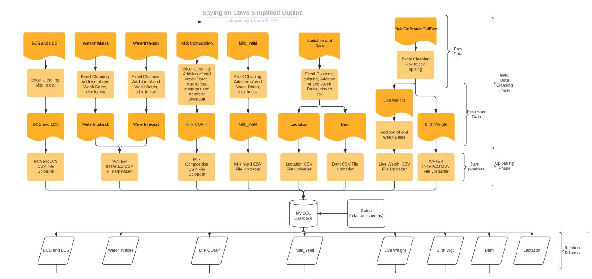
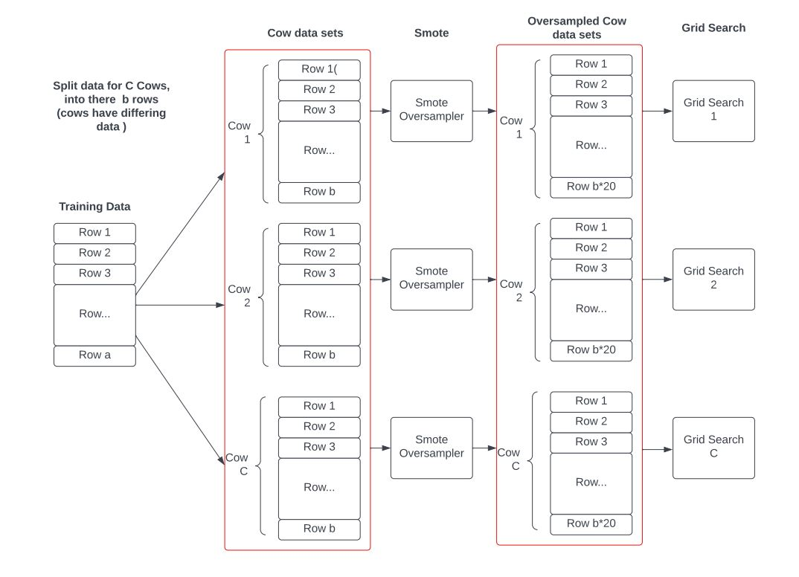
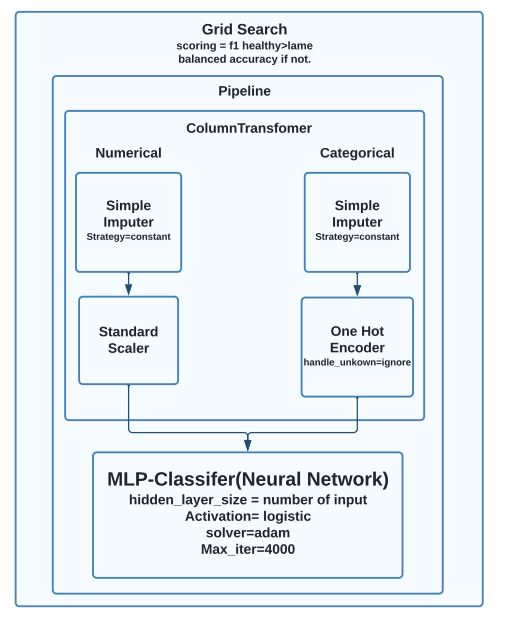
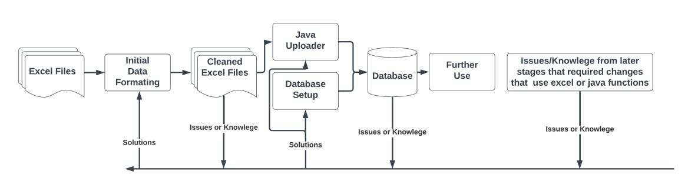

# Spying-On-Cows 🐄
This project builds a machine learning pipeline to detect lameness in dairy cows using both individual and herd-level behavioral and health sensor data. It explores how changes in the modeling strategy (individual vs. herd) affect performance and interpretability, using Explainable AI techniques.

## Project Overview

Modern dairy farms generate large volumes of behavioral and health data from individual cows. This project addresses the challenges of handling and interpreting this big data by:

- Creating a robust, clean, and consistent dataset from heterogeneous real-world sensor logs
- Building two parallel ML pipelines: one using **individual cow models**, and the other using **herd-level aggregation**
- Applying **oversampling**, **grid search**, **cross-validation**, and **XAI (LIME)** to explore model performance
- Comparing the strengths and limitations of each approach from both herd and individual perspectives
 
## What This Project Demonstrates

- Development of a custom ML pipeline for predictive health monitoring.
- Data integration from multiple sources and timeframes.
- Use of ensemble learning and hierarchical modeling techniques.
- Interpretability of model predictions using LIME.
- Skills in MySQL, Python, Java, Pandas, PyTorch, Scikit-learn.


## Key Results

- **Oversampling improved** individual cow model performance but **degraded** herd model performance
- LIME revealed **distinct feature importance** patterns across individual vs. herd models
- Demonstrated potential for **stacked ensemble models** or **hierarchical modeling** to combine both perspectives
- Identified novel predictive features and confirmed domain-specific ones (e.g., cow movement, water trough behavior)

## Skills & Techniques

- Deep Learning (ANN/DNN)
- Oversampling (SMOTE)
- Ensemble Learning / Bagging-inspired strategies
- Explainable AI (LIME)
- Data Cleaning, Aggregation & Wrangling
- Tools: Python, Java, MySQL, Excel, Pandas, Scikit-learn, PyTorch

##   Dataset Overview
Data

<p align="center">
  
  <br>
  <b>Figure:</b> Took in data from many sources of sensor recording and formatted to work in a consistent time frame for prediction  .
</p> 

<p align="center">
  
  <br>
  <b>Figure:</b> Left – challenges with traditional satellite data collection; Right – benefits of On-Orbit processing using edge ML.
</p>

## ML Pipeline

<p align="center">
  
  <br>
  <b>Figure:</b> Left – challenges with traditional satellite data collection; Right – benefits of On-Orbit processing using edge ML.
</p>

Creation of Dataset pipeline, Sklearn, Pytorch, 

<p align="center">
  
  <br>
  <b>Figure:</b> Left – challenges with traditional satellite data collection; Right – benefits of On-Orbit processing using edge ML.
</p>
<p align="center">
  
  <br>
  <b>Figure:</b> Left – challenges with traditional satellite data collection; Right – benefits of On-Orbit processing using edge ML.
</p>


 
## Project Structure

```bash
├── Python-ML/ # Pipeline code, model training, evaluation
├── SQL-Files/ # MySQL scripts for data aggregation
├── assets/ # Visual diagrams and screenshots
├── uploaders/ # Data handling scripts
``` 

 
## Model Evaluation

- Measured metrics include Evaluation metrics (Accuracy, Recall, precision,f1-score) and feature importance from LIME.
- Comparison between individual vs herd-based prediction strategies.
- Visualised explanations with LIME to show model trust and reliability.
